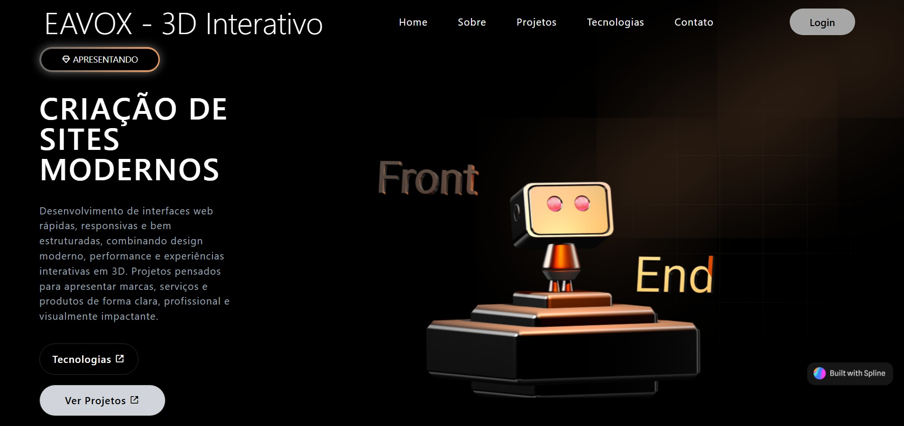

## 📌 Descrição do Projeto — Landing Page 3D com React e Vite

Este projeto consiste em uma **Landing Page desenvolvida como peça de portfólio**, com foco em demonstrar domínio em **front-end moderno**, **arquitetura baseada em componentes** e **design visual avançado**.

## 🖼️ Preview do Projeto

Abaixo está um preview visual da aplicação, demonstrando o layout, identidade visual e efeitos aplicados no projeto.

A aplicação foi projetada para apresentar uma identidade visual forte, com **layout futurista**, uso estratégico de **gradientes, efeitos de glow e blur**, além de uma estrutura preparada para **integrações futuras**, incluindo **elementos 3D e animações avançadas**.

O projeto segue princípios de **responsividade, performance e escalabilidade**, sendo ideal como base para sites institucionais, páginas de apresentação de produtos ou portfólios profissionais.

## 🌐 Acesso ao Projeto:

Você pode acessar o projeto online através do link abaixo:

🔗 **Demo / Site publicado:**
Site: [https://eavox-lp-react.vercel.app](https://eavox-lp-react.vercel.app)

📦 **Repositório do projeto:**
Repositório: [https://github.com/EdineiAndrade/eavox-lp-react](https://github.com/EdineiAndrade/eavox-lp-react)

---

## ⚙️ Descrição Técnica

**Nome do projeto:**
`eavox-lp-react`

### 🧰 Stack Tecnológica

- ⚡ **Vite** — ambiente de desenvolvimento rápido, moderno e otimizado
- ⚛️ **React** — arquitetura baseada em componentes reutilizáveis
- 🎨 **Tailwind CSS** — estilização utilitária com design system customizado
- 🧱 **HTML5 / CSS3**
- 📱 **Responsividade mobile-first**

---

## 🧩 Funcionalidades e Recursos

- Componentização modular e reutilizável
- Layout futurista com efeitos visuais (glow, blur e gradientes)
- Paleta de cores personalizada via Tailwind CSS
- Sistema de rotas com **React Router DOM**
- Navegação entre páginas sem recarregamento (SPA)
- Destaque de rota ativa utilizando `useLocation`
- Links internos com `Link` para melhor performance
- Animações de entrada com **AOS (Animate On Scroll)**
- Inicialização de efeitos com `useEffect`
- Ícones vetoriais com **Boxicons**
- Estrutura preparada para **elementos 3D** (ex: Three.js / React Three Fiber)
- Código organizado com foco em **manutenibilidade e escalabilidade**
- Build otimizado e alta performance com Vite

---

## 🎯 Objetivo do Projeto

Demonstrar competências técnicas em:

- Desenvolvimento front-end moderno com React
- Criação de interfaces visuais avançadas
- Implementação de navegação SPA com React Router
- Uso estratégico do Tailwind CSS para design consistente
- Integração de bibliotecas de animação e ícones
- Preparação de aplicações para experiências 3D e interativas

-------------------------
